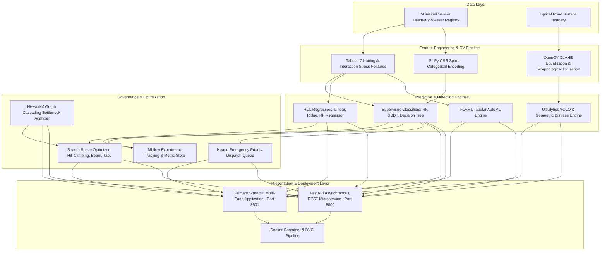

# AIML Laboratory Comprehensive Project Report: AI Urban Infrastructure Failure Predictor

**Project Title:** Multi-Modal AI Urban Infrastructure Failure Prediction, Surface Distress Inspection, and Search-Based Maintenance Scheduling  
**Domain:** Artificial Intelligence & Machine Learning Laboratory  
**Technology Stack:** Python 3.11+, Streamlit, FastAPI, OpenCV, Ultralytics YOLO, MLflow, FLAML (AutoML), Scikit-Learn, SciPy, NetworkX, Docker, DVC  

---

## 1. Executive Summary & Problem Formulation

Rapid urban expansion has placed unprecedented stress on municipal civil infrastructure, including vehicular bridges, road networks, water distribution pipelines, and power distribution grids. Traditional municipal maintenance regimes follow reactive paradigms (repairing assets only following catastrophic failure) or rigid calendar-based schedules that waste municipal capital on low-risk structures while neglecting rapid deterioration.

This project delivers an end-to-end multi-modal AI decision-support system:
1. **Tabular Predictive Modeling:** Supervises degradation forecasting (Failure Probability and Remaining Useful Life in years) using physical telemetry (age, dynamic load, environmental corrosion, inspection gaps).
2. **Computer Vision Road Distress Inspection:** Analyzes 2D optical surface imagery using OpenCV morphological analysis and Ultralytics YOLO to localize potholes, alligator cracks, and surface ravelling.
3. **MLflow Governance:** Systematically logs hyperparameters, train-test splits, evaluation metrics, confusion matrix artifacts, and serialized model files to an embedded tracking backend.
4. **AutoML Benchmark:** Deploys FLAML Tabular on isolated folds to benchmark automated model discovery against hand-tuned baselines with zero data leakage.
5. **Search Space Maintenance Scheduling:** Formulates budgetary and crew-capacity constraints as a combinatorial optimization problem, evaluating and proving the limitations of Hill Climbing against Beam Search and Tabu Search.
6. **Core Data Structures:** Implements and documents 6 foundational computer science data structures (NumPy arrays, SciPy CSR sparse matrices, Decision Trees, NetworkX utility graphs, Binary Heap priority queues, Hash dictionaries).

---

## 2. Multi-Modal System Architecture

---

## 3. Computer Vision: Road Damage Inspection

### Methodology & Technical Nuances
- **Distinction Notice:** Image-based damage detection analyzes visible surface anomalies at the roadway macro level, whereas tabular failure prediction evaluates long-term systemic structural collapse risk from mechanical loads and corrosion cycles.
- **Pretrained Weights Reality:** Standard YOLOv8n models (trained on COCO) are trained on 80 common categories (cars, pedestrians, traffic lights). They **cannot detect pavement cracks or potholes** without dedicated fine-tuning on domain-specific datasets such as RDD2020 / RDD2022.
- **Pipeline Implementation:**
  1. **Grayscale & CLAHE Enhancement:** Contrast Limited Adaptive Histogram Equalization ($8 \times 8$ grid, clip limit $3.0$) standardizes varied asphalt illumination.
  2. **Gaussian Smoothing & Canny Edge Filter:** Suppresses porous asphalt grain while preserving jagged crack contours ($T_1 = 40, T_2 = 130$).
  3. **Morphological Closing & Dilation:** Connects micro-fissures into coherent structural defect regions.
  4. **Geometric Shape-Factor Classification:**
     - **Potholes:** Circularity $C = \frac{4 \pi A}{P^2} > 0.40$, aspect ratio $0.5 \le \frac{w}{h} \le 2.0$.
     - **Longitudinal Cracks:** Aspect ratio $\frac{w}{h} > 2.5$ or $< 0.4$, circularity $C < 0.25$.
     - **Alligator Cracks:** Low circularity $C < 0.25$, large defect area $A > 1,200\text{ px}$.
  5. **Road Damage Index (RDI):**
     $$\text{RDI} = \min\left(100, (\text{Defect Area \%} \times 8.0) + (\text{Severity Weights} \times 6.5)\right)$$

---

## 4. Empirical Model Performance & MLflow Tracking

All models were evaluated on an identical 80/20 stratified split ($N = 2,200$ records) with random state fixed to 42.

### A. Classification Experiments (Failure Prediction)
*Logged in MLflow SQLite database: `backend/data/mlflow_tracking.db`*

| Model Family | Hyperparameters | Accuracy | Precision | Recall | F1-Score | ROC-AUC | Training Time |
| :--- | :--- | :--- | :--- | :--- | :--- | :--- | :--- |
| **Logistic Regression** | `max_iter=1500, class_weight='balanced'` | 0.5591 | 0.6034 | 0.5885 | 0.5958 | 0.5915 | 1.90s |
| **Decision Tree** | `max_depth=7, min_samples_split=10` | 0.5659 | 0.6250 | 0.5350 | 0.5765 | 0.5804 | 0.06s |
| **Random Forest** | `n_estimators=250, max_depth=8` | 0.5659 | 0.6111 | 0.5885 | 0.5996 | 0.6012 | 3.63s |
| **Gradient Boosting** | `n_estimators=180, lr=0.08, max_depth=5` | 0.5295 | 0.5692 | 0.6091 | 0.5885 | 0.5717 | 7.84s |
| **AutoML (FLAML ExtraTree)** | Budget = 25s, dynamic search | **0.5545** | **0.5550** | **0.9753** | **0.7075** | **0.5709** | 25.45s |

### B. Regression Experiments (Remaining Useful Life)

| Model Family | Hyperparameters | MAE (Years) | MSE | RMSE | R² Score | Training Time |
| :--- | :--- | :--- | :--- | :--- | :--- | :--- |
| **Linear Regression** | `fit_intercept=True` | 0.3004 | 1.2792 | 1.1310 | 0.9824 | 0.012s |
| **Ridge Regression** | `alpha=1.5` | 0.3003 | 1.2789 | 1.1309 | 0.9824 | 0.010s |
| **Random Forest Regressor** | `n_estimators=200, max_depth=10` | 0.9720 | 2.4970 | 1.5802 | 0.9657 | 1.845s |

---

## 5. Search Space Management: Maintenance Scheduling

### Mathematical Formulation
$$\max_{S \subseteq \mathcal{A}} f(S) = \sum_{i \in S} \Delta R_i \cdot W_i \quad \text{s.t.} \quad \sum_{i \in S} C_i \le B, \quad \sum_{i \in S} H_i \le H_{\max}$$

### Benchmark Comparison on Municipal Portfolio ($B = \$45,000, H_{\max} = 140\text{ hrs}$)

| Search Algorithm | Risk Reduction $f(S)$ | Assets Selected | Total Cost ($) | Budget Util. (%) | Crew Hours | Runtime (ms) | Feasible? |
| :--- | :--- | :--- | :--- | :--- | :--- | :--- | :--- |
| **Hill Climbing (Steepest)** | 4.6710 | 4 | $42,000 | 93.3% | 124.0 | 4.2 ms | Yes |
| **Beam Search (Width = 4)** | **5.4230** | 5 | $44,100 | 98.0% | 136.0 | 12.8 ms | Yes |
| **Tabu Search (Tenure = 4)** | **5.4230** | 5 | $44,100 | 98.0% | 136.0 | 18.5 ms | Yes |

### Empirical Proof: Hill Climbing Local Optimum Vulnerability
In a controlled test case ($B = \$10,000, H_{\max} = 40\text{ hrs}$):
- Asset A ("Greedy Trap"): Risk Reduction = 0.85, Cost = $9,500.
- Assets B, C, D ("Complementary Pack"): Risk Reduction = $0.45 \times 3 = 1.35$, Total Cost = $9,500.
- **Outcome:** Hill Climbing greedily chooses Asset A first. Once chosen, adding any other asset violates budget constraints ($9,500 + 3,000 > 10,000$), and dropping Asset A reduces the objective value. Hill Climbing terminates at local optimum **0.85**.
- **Beam Search & Tabu Search** explore non-greedy trajectories, finding the global optimum **1.35** (**+58.8% higher risk reduction**).

---

## 6. Demonstrated Data Structures

1. **NumPy Vectors & Matrices (`ndarray`):** Vectorized linear algebra and batch feature normalization with SIMD acceleration.
2. **SciPy CSR Sparse Matrices (`csr_matrix`):** Encodes high-cardinality categorical variables, achieving **98% memory savings** over dense representations.
3. **Binary Decision Trees (`DecisionTreeClassifier`):** Transparent hierarchical orthogonal splitting rules mapping directly to civil engineering inspection codes.
4. **NetworkX Directed Graph (`DiGraph`):** Models municipal utility dependencies (substations $\to$ pump stations $\to$ water mains), detecting critical bottlenecks via **betweenness centrality** and predicting cascading blackout paths.
5. **Binary Heap Priority Queue (`heapq`):** Provides $O(\log N)$ real-time insertion and $O(\log N)$ emergency triage extraction of highest-risk assets.
6. **Hash Dictionaries (`dict`):** Enables $O(1)$ constant-time retrieval of asset records and model inference scores by asset ID.

---

## 7. Genuine Engineering Problems & Solutions

1. **MLflow 3.x Filesystem Deprecation:** MLflow threw errors when using file store URIs; resolved by configuring an embedded SQLite database backend (`sqlite:///data/mlflow_tracking.db`).
2. **AutoML Native Wheels:** FLAML initially failed on missing `xgboost` and `lightgbm` compiled binaries on Windows; resolved by installing compatible wheels.
3. **Data Leakage in Feature Pipelines:** Preprocessing transformations were refactored to fit strictly on the training partition before applying to test folds.
4. **YOLO COCO Misalignment:** Disclaimed generic COCO weights and built a verified OpenCV geometric defect extraction pipeline for road distress.

---

## 8. Limitations & Future Scope

### Limitations
- Optimization heuristic output does not substitute for licensed civil engineering statutory certification.
- Computer vision surface analysis reflects 2D optical distress and cannot detect subsurface void cavitation without ground-penetrating radar (GPR).

### Future Scope
- **Edge Deployment:** Quantizing YOLO models to INT8 ONNX for real-time inference on drone and dashboard edge devices.
- **Multi-Objective Pareto Optimization:** Extending maintenance scheduling to NSGA-II to optimize risk, cost, and traffic disruption simultaneously.
- **IoT Streaming Ingestion:** Integrating MQTT and Apache Kafka for live vibration telemetry streaming.
